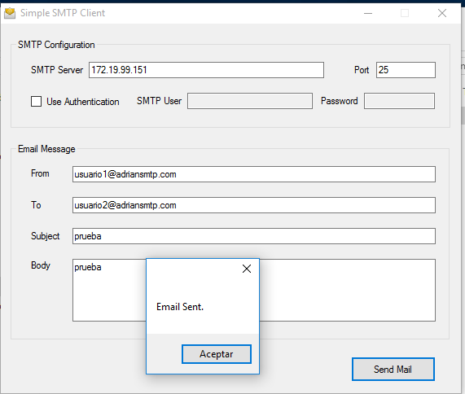
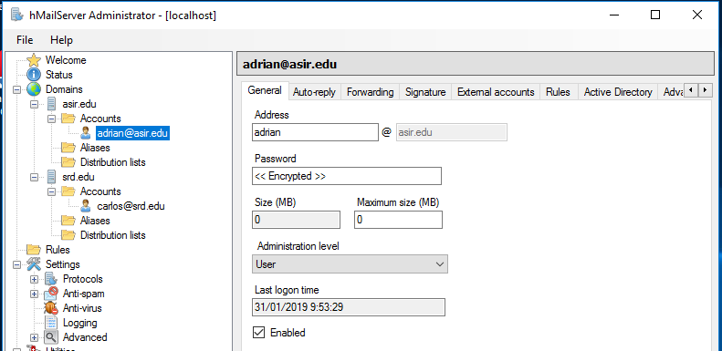

# Servicio SMTP Windows 2016 Server

## Instalación de SMTP

* Instalar Servicio SMTP en Windows 2016 Server

## Configuración de SMTP

* Configuración de servicio SMTP a través del administrador de aplicaciones (IIS) 6.0. Realizar las siguientes acciones de configuración:

  - Establecer como IP todas las asignadas.
  - Limitar el número de conexiones a 50.
  - Habilitar el registro en formato W3C, diario y en una carpeta determinada.

  - Configurar envío de mensajes dentro de nuestra red local: Aceptar la conexión al servidor y la retransmisión de mensajes a todos los equipos menos los que aparecen en la lista.

  - Establecer autenticación anónima

  

  - Echar un vistazo al resto de opciones de configuración del servidor. Aplicar cambios y reiniciar servicio.
  - Comprobar la existencia del dominio AD predeterminado. Crea un dominio de tipo alias para disponer de cuentas en otro dominio.

  

  

  

  - Comprueba carpetas de correo creados en C:\Inetpub\mailroot.

  

### Cliente Windows:

* Comprobar acceso al nuevo nombre DNS creado en el servidor.

    

  

* Configurar el cliente de correo Live mail agregando dos cuentas de correo cualesquiera (usuarios AD -dominio- y no AD). Se deberá especificar: usuario / buzón, contraseña,  servidor SMTP.

* Enviar varios correos desde / hacia las diferentes cuentas y comprobar envío (real o ficticio) y carpetas mailroot. Las carpetas existentes en mailroot alojan mensajes en cola (Queue), mensajes para destinatarios desconocidos (Badmail) y mensajes entregados (Drop).

  

  

  

  

### Servidor SMTP:

* Nueva configuración de servicio SMTP a través del administrador de aplicaciones (IIS) 6.0. Establecer autenticación básica de Windows. Probar diferentes configuraciones de dominio predeterminado, cifrado TLS, etc.

### Cliente Windows:

* Configurar las cuentas según los parámetros especificados en el servidor. Enviar varios correos desde / hacia las diferentes cuentas y comprobar envío y carpetas mailroot. En este caso sólo tendrán acceso al servidor SMTP cuentas del dominio y correspondientes a usuarios de AD.

# hMailServer

## Configuración de hMailServer en Windows Server

* Descargamos e instalamos en el servidor Windows 2016 server el servidor de correo hMailServer.
* Creamos dos dominios denominados srd.edu y asir.edu.

* Ejecuta los diagnósticos para ambos dominios y soluciona el error de backup asignando una carpeta para tal fin. Establece copia de seguridad de los mensajes.

* Crea dos cuentas para dos usuarios ficticios en cada uno de los dos dominios. Investiga y configura las cuentas con diferentes opciones (cuota de disco, auto-reply, forwarding, signature, etc.)

* Configura el servicio DNS para crear las entradas mail.srd.edu y mail.asir.edu que apunten a la dirección ip del servidor windows.

* Realiza todas las opciones de configuración que consideres necesarias y/o convenientes.

* Configura en el cliente Windows un cliente de correo como thunderbird (en los ordenadores clientes) para acceder al servidor de correo instalado en Windows 2016.

* Realiza prueba de envío y recepción de correos entre los diferentes usuarios, comprobando, además de envío y recepción correctas, el efecto de las opciones configuradas en las cuentas.

* Crea una lista de distribución empleados asociada al dominio y añade a los dos usuarios de asir.edu a ella.

* Realiza prueba de envío y recepción de correos por medio de la lista de distribución.

