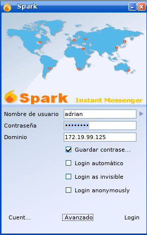

# Instalación y Configuración de un Servidor de Mensajería Instantánea

## Instalación Openfire

Descargamos el paquete de la página oficial http://www.igniterealtime.org/projects/openfire/index.jsp.

* Instalamos el paquete descargado con la herramineta *alien*.

 

## Integrando MySQL con el servidor Openfire

Abrimos una terminal y nos pasaremos al modo consola de MySQL como se muestra a continuación:

*  Dar de alta la base de datos para el servidor de mensajería openfire.

Posteriormente nos dirigimos al siguiente directorio e importamos el fichero .sql a la base de datos que creamos, en este caso como nuestro manejador de bases de datos es MySQL seleccionamos el fichero .sql que hace referencia a mysql como se muestra a continuación:

Asignamos al administrador de openfire una cuenta dentro de MySQL y luego de ello asignarle a este usuario permisos de lectura, escritura y ejecución sobre la base de datos que antes creamos, esto se consigue de la siguiente manera.

## Openfire

Iniciamos el sevidor de mensajería Openfire.

Completamos la Instalación del proceso del servidor Openfire.

## Comprobación del Servicio

Entramos en una máquina cliente y accedemos mediante la ip del servidor y el puerto 90:90

Creamos usuarios para poder probar si funciona nuestro servicio de mensajería.

### Spark

Descargamos e instalamos Spark desde la página anteriormente mencionada.

Una vez dentro nos logeamos mediante los usuarios anteriormente creados y colocamos la ip del servidor. Esto tendremos que hacerlo en las dos máquinas para comprobar su funcionamiento.

Buscaremos los usuarios los añadiremos y ya podremos empezar a utilizar el chat.

Por último probamos la opción de realizar conferencias.

