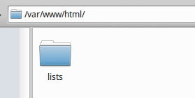
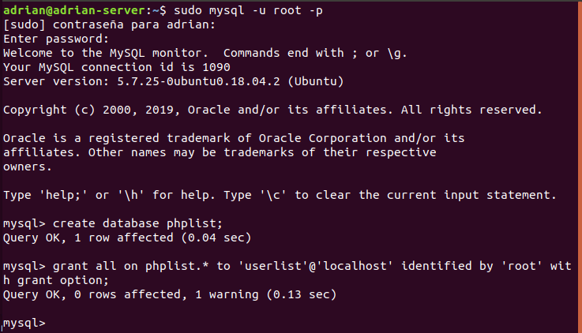
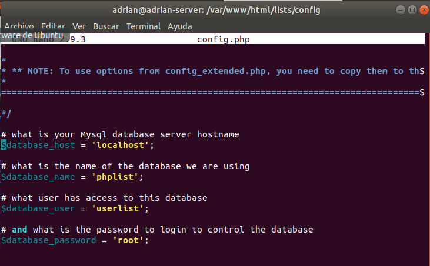
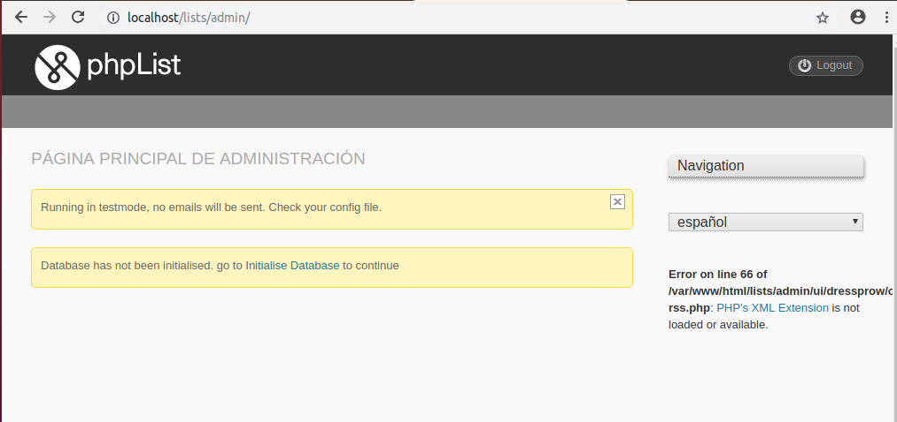
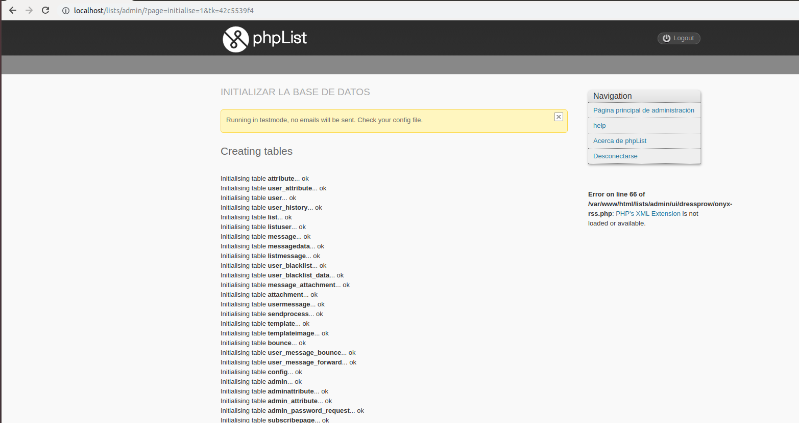
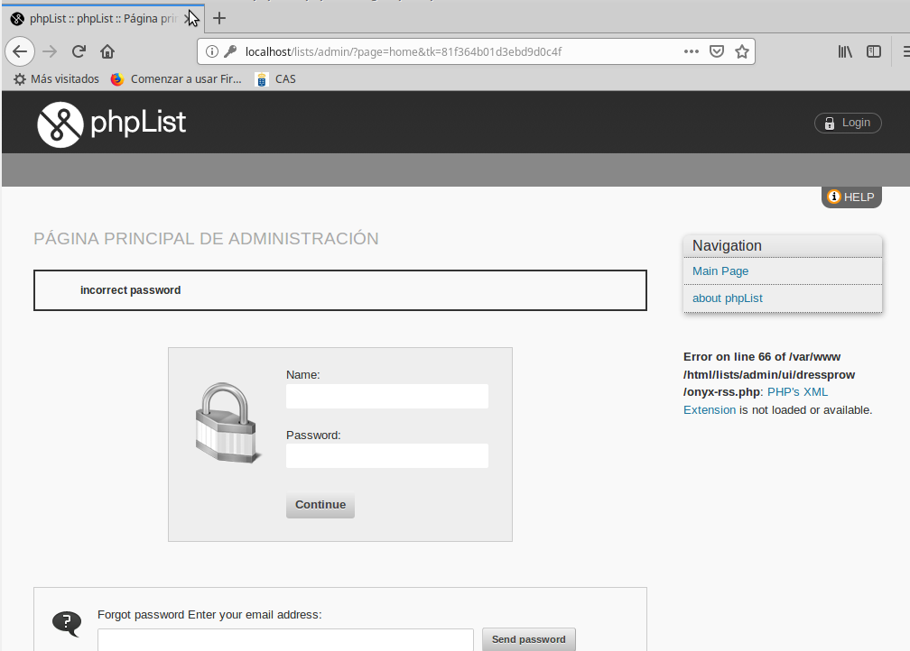

# Listas de Distribución

Se pide realizar y subir a la plataforma un informe sobre la práctica a realizar en grupo sobre la instalación, configuración, mantenimiento y prueba de un servicio de gestión de Listas de Distribución basado en el software open source phpList.

* Descargamos el paquete de phpList desde su página oficial, lo descomprimimos y copiamos la carpeta *list* en */var/www/html/*

 

 * Entramos a mysql, creamos una nueva base de datos, un nuevo usuario y le concedemos permisos.

 

 * Nos dirigimos al fichero de configuración de phpList y colocamos los datos de nuestra base de datos y usuarios anteriormente creados.

  

  * Nos dirigimos al navegador y colocamos la ruta *localhost/lists/admin/*.

 

 * Intentamos saltarnos el formulario donde tenemos que poner los datos e intentamos iniciar la base de datos.

 

 * Al final no pudimos solucionar el problema y por mucho que cambiemos el lenguaje en el fichero de configuración nos sigue saliendo como un error. No podemos pasar de la autentificación del panel de administración.

  

Como última opción descargamos otro paquete del phpList y probamos en distintas distribuciones pero todo fue en vano...
