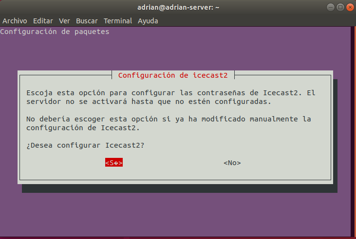
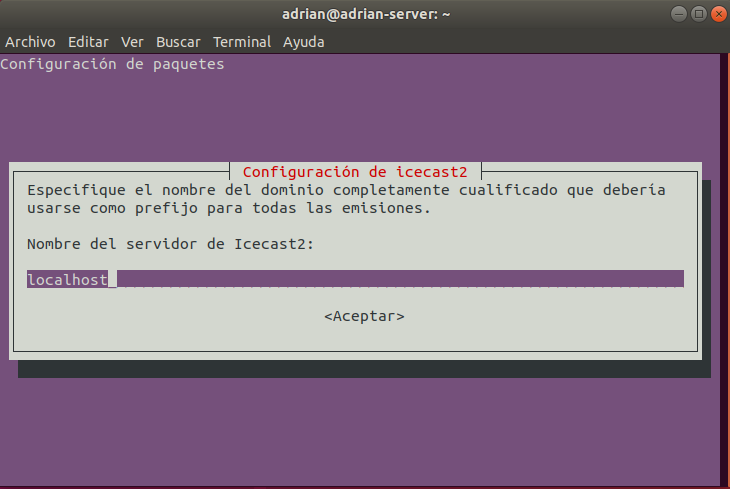
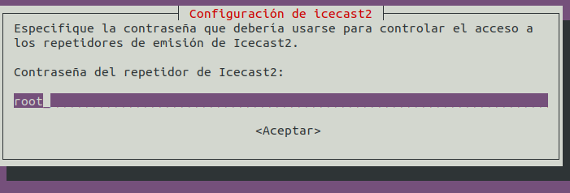
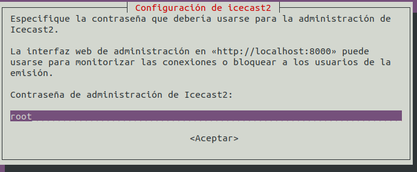
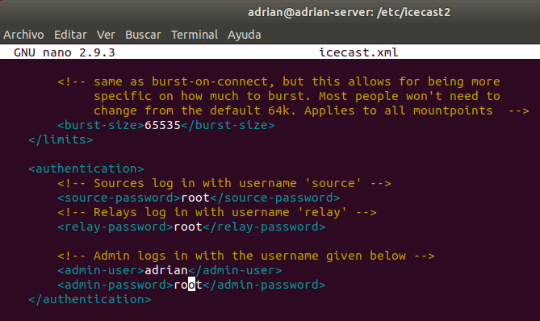

# Instalación y configuración de un servidor Multimedia
## Introducción
En esta actividad

---

# 1. Icecast2
## 1.1. Instalación
Comenzamos a instalar y configurar `icecast2`

Especificamos el nombre del dominio

Establecemos la contraseña para controlar el acceso a los repetidores de emisión

También tendremos que establecer la contraseña para administrar la herramienta

A continuación, vamos a editar el fichero */etc/icecast/icecast2.xml*

