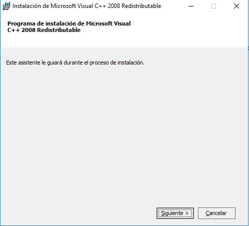
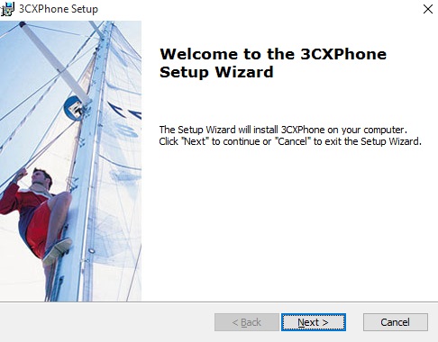
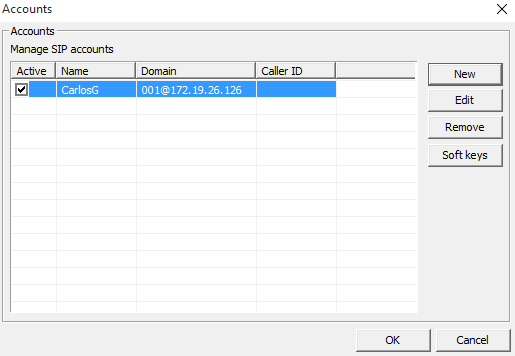

# Servicio VoIP
## Introducción
En esta actividad instalaremos un servicio de llamadas con la herramienta **PBX 3CX**, comprobando el envío y recepción de llamadas.

---

# 1. BX 3CX Phone System
## 1.1. Instalación
Comenzamos instalando el software de administración **PBX 3CX Phone System**. Vemos los requerimientos que nos exige.

Establecemos la ruta de instalación

Comenzamos la instalación

Tendremos que instalar también el complemento **Microsoft Visual C++**

Completamos la instalación

Además, tendremos que instalar otro complemento aparte

Seguimos la instalación colocando el código de licencia que se nos ha sido enviado a nuestro correo

## 1.2. Configuración
Iniciamos sesión con el usuario administrador para acceder a su panel

Confirmamos que usaremos esa IP Pública

Indicamos que sea estática

Elegimos un nombre de subdominio

Visualizamos los puertos de acceso por defecto

Seleccionamos el adaptador de red predeterminado

También tendremos que elegir la longitud de las extensiones

Introducimos un correo para posibles notificaciones del sistema

Elegimos el país y zona horaria correspondiente

Vamos a crear el primer usuario por defecto con todos sus datos: número de extensión, nombre, correo electrónico...

Tenemos la posibilidad de elegir a que región del planeta podemos hacer llamadas. Elegimos Europa.

Seleccionamos el idioma de nuestra preferencia

Confirmamos los datos de registro

Una vez hemos terminado esto, recargamos la página y volvemos a acceder al panel de administración

Vemos como ya tenemos creada una extensión con el usuario creado anteriormente

Crearemos otros usuarios con una extensión distinta

## 1.3. Comprobación
Para comprobar que la configuración realizada es correcta, descargaremos un software cliente para realizar llamadas, en este caso, usaremos **SIP softphone 3CX Phone**

Iniciamos sesión con uno de los usuarios creados en pasos anteriores

Vemos como se ha creado

También tendremos que instalar el mismo programa en una máquina cliente para hacer/recibir llamadas

Completamos la instalación

Visualizamos la interfaz del programa

Iniciamos sesión también con otro de los usuarios diferente al del servidor

Comprobamos que se ha creado

Ya podemos realizar y recibir llamadas mediante las extensiones. Llamamos desde el servidor al cliente

Recibimos la llamada desde el servidor

Y establecemos la llamada correctamente

Llamamos inversamente en esta ocasión

Recibimos la llamada en el servidor proveniente del cliente

Y establecemos la llamada

Comprobamos las llamadas realizadas

