# Instalación y configuración de un servidor Multimedia
## Introducción
En esta actividad montaremos un servicio de streaming multimedia, accediendo al mismo desde el propio servidor y cliente, comprobando sus funcionalidades.

---

# 1. Icecast2
Comenzamos a instalar y configurar `icecast2`

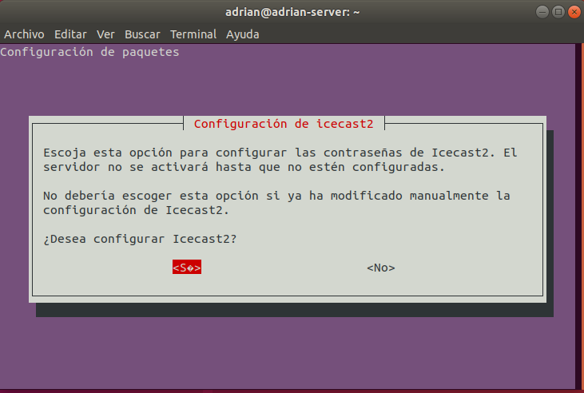

Especificamos el nombre del dominio

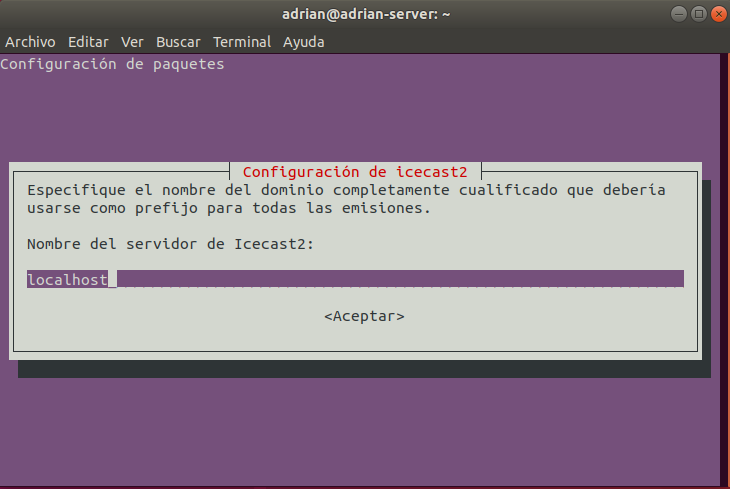

Establecemos la contraseña para controlar el acceso a los repetidores de emisión

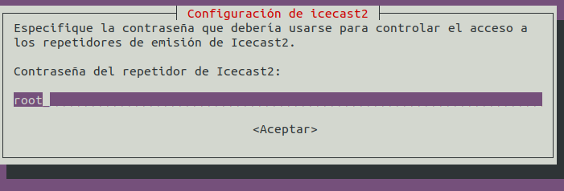

También tendremos que establecer la contraseña para administrar la herramienta

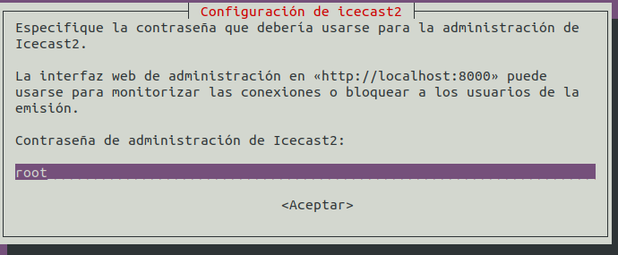

A continuación, vamos a editar el fichero */etc/icecast/icecast2.xml*, modificando una serie de líneas del mismo para configurarlo a nuestro interés

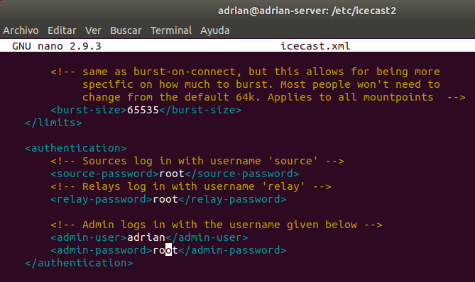

Además, editaremos el fichero */etc/default/icecast* y modificaremos la línea `ENABLE=true`

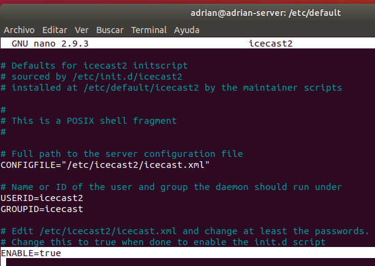

Una vez hecho esto, iniciamos el servicio de `icecast` con `systemctl start icecast2` y consultamos su estado

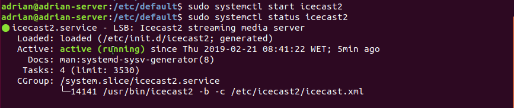

# 2. Codificador Vorbis Ices2
Por otro lado, tendremos que instalar el codificador vorbis con `apt install ices2`

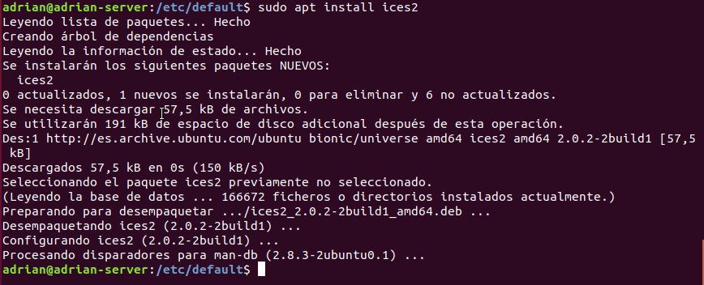

Lo siguiente sería copiar el fichero de configuración por defecto desde */usr/share/doc/ices2/examples/ices-playlist.xml* a */etc/ices2*

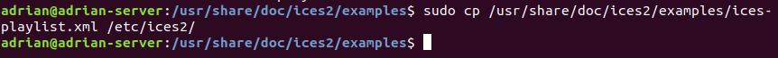

Editamos dicho fichero a nuestro parecer, cambiando algunas etiquetas

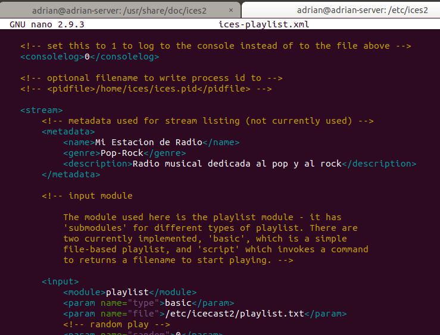

Modificamos las líneas correspondientes al puerto, la contraseña y el punto de montaje

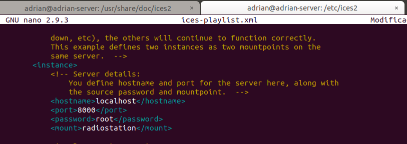

Teniendo esto configurado, descargaremos dos ficheros de audio en formato **.ogg**

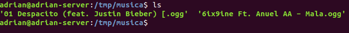

Generamos la lista de reproducción, introduciendo la ruta de los ficheros de audio en el fichero *playlist.txt*

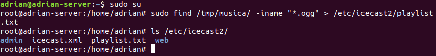

Creamos el directorio */var/log/ices2* y ejecutar el codificador en segundo plano */etc/ices2/ices-playlist.xml &*

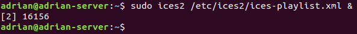

Accedemos desde un navegador al servidor de audio con la IP y el puerto corrrespondiente

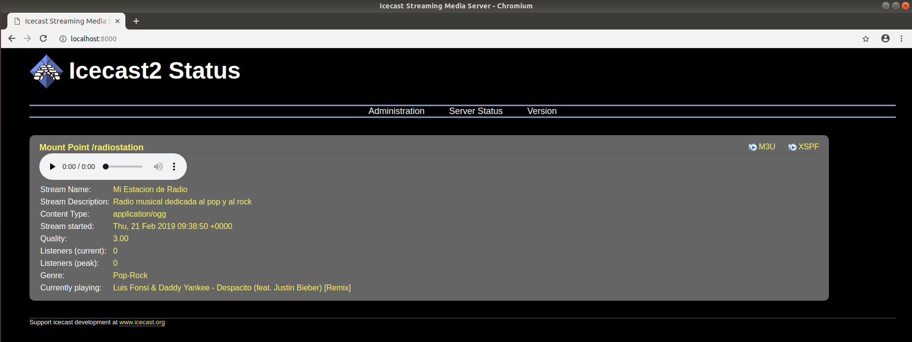

También accedemos al entorno de administración

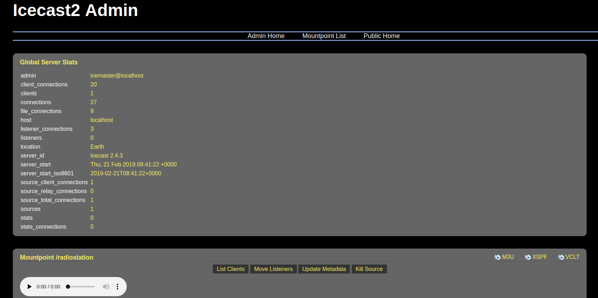

Comprobamos que el punto de montaje funciona correctamente

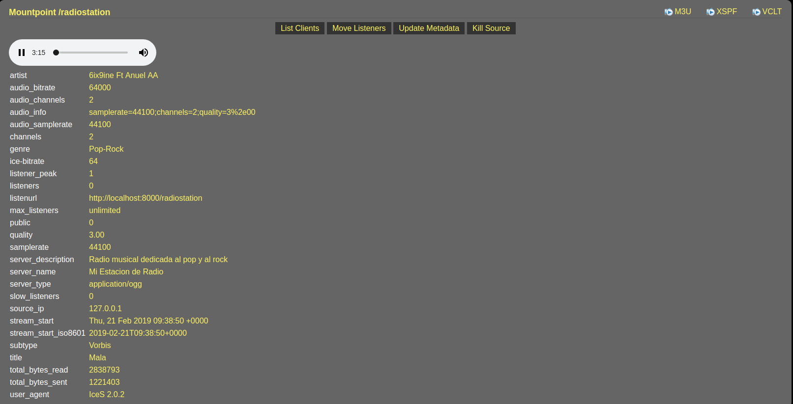

Vemos el reproductor del punto de montaje accediendo a `localhost:8000/radiostation`

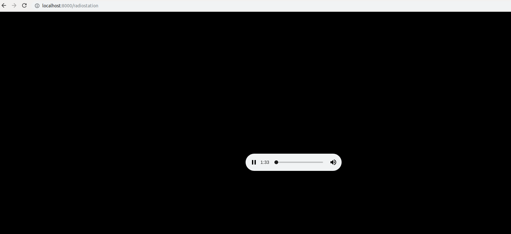

Es momento de comprobar el funcionamiento desde una máquina cliente. Para ello, accedemos mediante la IP al servicio: `172.19.99.125:8000`

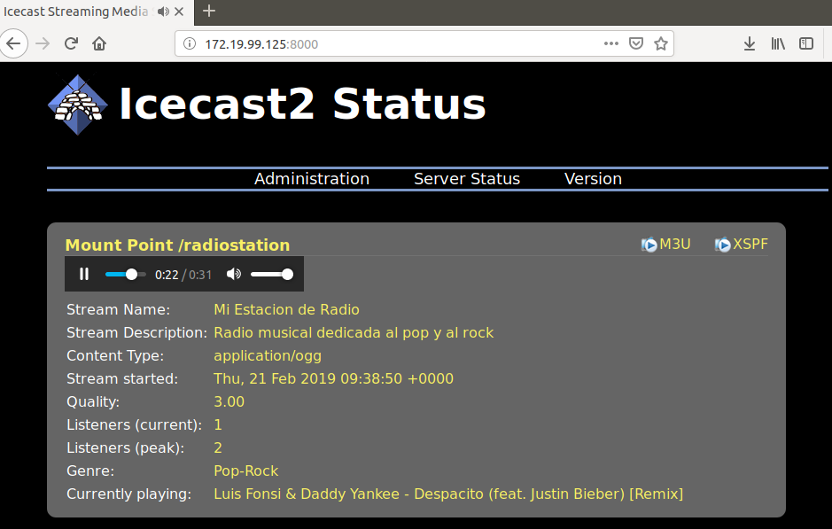

Vamos a comprobar el entorno de administración desde el cliente

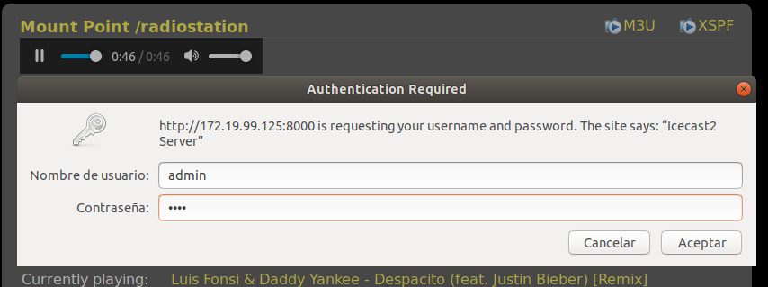

Vemos el panel de administración

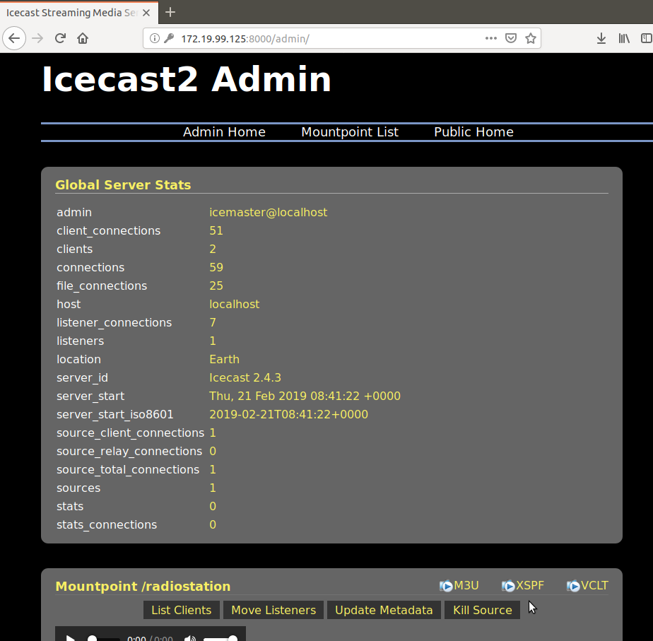

Por último, accedemos al punto de montaje utilizando el software reproductor multimedia que contiene

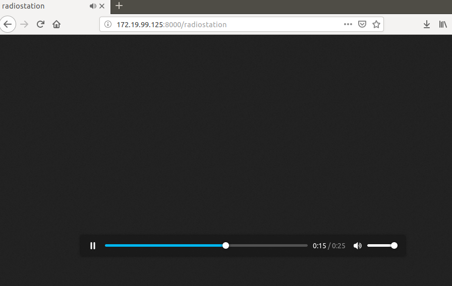

